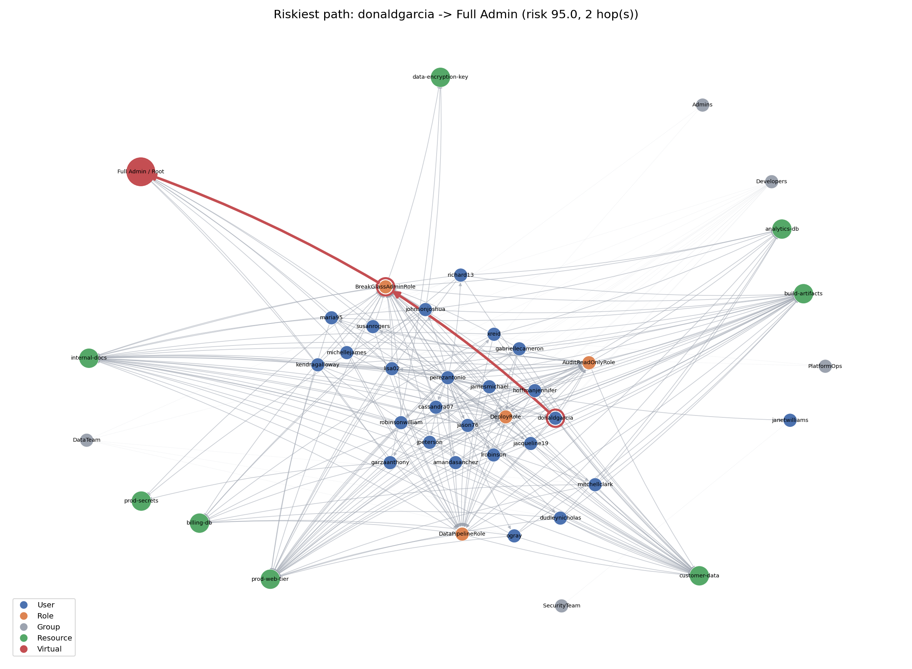
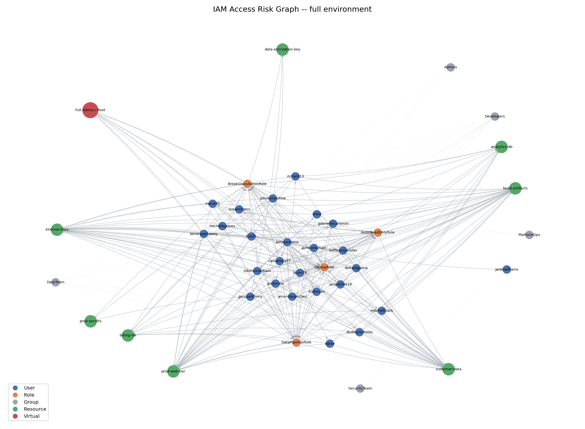

# Access Risk Analyzer


**Models a cloud IAM environment as a graph, finds privilege-escalation
attack paths through it, and proves which permissions are safe to remove
by re-running the graph without them.**

Same family of problem as PMapper / Cloudsplaining for AWS, or BloodHound
for Active Directory — but built end-to-end here as a single Python
pipeline, with a least-privilege engine wired directly into the attack
graph instead of bolted on as a separate report.

---

### The finding that motivated this project

> A developer with `iam:PassRole` + `ec2:RunInstances` — neither fully explains the impact in isolation
>  — can launch an EC2 instance with an admin role attached and
> harvest its credentials. No single permission they hold looks like a
> problem. The *chain* is the problem. That's a graph traversal, not a
> policy lint.


*A real path found in a seeded run: `donaldgarcia → BreakGlassAdminRole → Full Admin`, 2 hops, risk 95/100 — driven by an unscoped `PassRole` grant.*

## Key results (25-user seeded run)

| Metric | Before remediation | After remediation |
|---|---|---|
| Users with an escalation path to full admin | **19 / 25** | **10 / 25** |
| Avg. risk score of *remaining* admin paths | 94.3 | 95.0 |
| High-risk users without MFA | 5 | — |

That second row isn't a bug — it's survivorship bias by design. Trimming
removes the *cheapest* escalation paths first (that's what "low weight"
means in the graph), so the average severity of whatever paths survive
can tick up slightly even as the total count drops from 19 to 10. The
remediation worked; what's left is the smaller, genuinely harder subset.

The "after" column isn't a guess — it's produced by rebuilding the attack
graph using each identity's *actually-used* permissions (simulated from a
90-day usage log) instead of everything they were granted, and re-running
the same Dijkstra search. **Removing the unused permissions the
least-privilege engine flagged closes 9 of 19 admin-escalation paths.**

## How it works

```
Fake IAM data  →  Weighted attack graph  →  Graph-based attack paths (Dijkstra)
     │                                                    │
     ▼                                                    ▼
Simulated usage logs → Least-privilege recs → Before/after remediation impact
```

1. **`data_generator.py`** — synthetic but realistic IAM environment
   (users, groups, roles, managed/inline policies, resources) via `Faker`.
   A configurable fraction of users get an extra "convenience" policy
   layered on top of normal access, modeling real permission creep rather
   than hand-placed scenario flags. Deterministic given a seed.

2. **`privesc_rules.py`** — a catalog of known IAM privilege-escalation
   techniques, each mapped to a MITRE ATT&CK (Cloud) technique ID:

   | Technique | ATT&CK ID |
   |---|---|
   | Create access key / reset password for another user | T1098.001 |
   | Attach/put a policy onto self, create a new policy version | T1098.003 |
   | `PassRole` + `RunInstances` / Lambda | T1548.005 |
   | Rewrite a role's trust policy | T1098.003 |
   | Assume a role via an overly permissive trust policy | T1078.004 |

3. **`graph_builder.py`** — builds a directed, weighted `networkx` graph.
   Edge weight encodes how cheap/reliable a technique is for an attacker
   (lower = more dangerous). Accepts an `overrides` map so the same
   builder constructs a "what if this identity only had its actually-used
   permissions" graph — this is what powers the remediation comparison.

4. **`attack_paths.py`** — two deliberately separate analyses:
   - `find_privesc_paths_to_admin` — cheapest chain of escalation
     techniques from each user to full admin (the headline result).
   - `find_resource_exposure_paths` — complementary "blast radius" metric:
     how directly each user can reach a resource tagged sensitivity=high,
     independent of admin takeover.

5. **`least_privilege.py`** — simulates a 90-day usage log per identity,
   diffs granted vs. used actions, and flags unused permissions that are
   specifically the ingredients of a known escalation technique. Identities
   holding a literal `AdministratorAccess` wildcard are called out rather
   than silently scored, since a wildcard can't be diffed against a usage
   log. `remediation_impact()` rebuilds the graph with trimmed permissions
   and reports how many users still have a path to admin afterward.

6. **`risk_report.py` / `visualize.py`** — composite 0–100 risk score per
   user (escalation risk + resource exposure + least-privilege gap), CSV +
   JSON output, and `networkx`+`matplotlib` renderings of the full graph
   and the single riskiest path.


*Blue = users, orange = roles, green = resources, gray = groups, red = the virtual "full admin" node. Density here is itself a finding: this many edges into one red node is what an auditor is looking for.*

## Running it

Recommended (installs the package properly, no `sys.path` issues):

```bash
python -m pip install -e ".[dev]"
python -m access_risk_analyzer.main --num-users 25 --seed 42 --output-dir output
```

Or without an editable install:

```bash
pip install -r requirements.txt
python -m access_risk_analyzer.main --num-users 25 --seed 42 --output-dir output
```

Outputs land in `output/`:
- `iam_data.json` — the generated environment
- `attack_paths.json` — every escalation-to-admin and resource-exposure
  path found, with the exact technique chain and ATT&CK IDs
- `least_privilege_recommendations.json` — per-identity trimmed policy
  recommendations
- `risk_report.csv` / `risk_summary.json` — composite scoring
- `attack_graph.png` / `top_risk_path.png` — visualizations

### Tests

```bash
python -m pip install -e ".[dev]"   # or: pip install -r requirements.txt -r requirements-dev.txt
python -m pytest -q
```

9 sanity tests — they don't try to prove the security findings are
*realistic* (that's a judgment call, see below), they check that the
pipeline's internal logic is consistent: every reported path is actually
walkable in the graph, remediation never "increases" the number of admin-reachable identities in the tested scenario, the report's
row count matches the user count, the dataset is deterministic given a
seed, and so on.

## Design notes / honesty about scope

- This runs on a **synthetic** dataset, not a live AWS/Azure/GCP account.
  Wiring `data_generator.py`'s output format to a real
  `aws iam get-account-authorization-details` export (or the Azure/GCP
  equivalents) is the natural next step and wouldn't require changing the
  graph/analysis layers at all — only the data-loading layer.
- Resource-level permission scoping (`Resource: "arn:aws:s3:::specific-bucket"`)
  is simplified to service-level (`s3:*` grants access to "an S3 bucket"
  rather than one specific ARN). Real environments are usually *more*
  constrained than this model, not less — treat the absolute path counts
  as illustrative of the technique, not a literal vulnerability count.
- The 90-day usage log is simulated (a random subset of granted actions),
  not pulled from a real access-advisor export. The diffing/recommendation
  *logic* is the deliverable; plugging in a real usage source is a
  data-layer swap, not a redesign.

## Stack

Python 3.10+ · `networkx` (graph construction + Dijkstra shortest paths) ·
`matplotlib` (visualization) · `Faker` (synthetic identity data) ·
`pytest` (sanity tests). No external services or API keys required.
